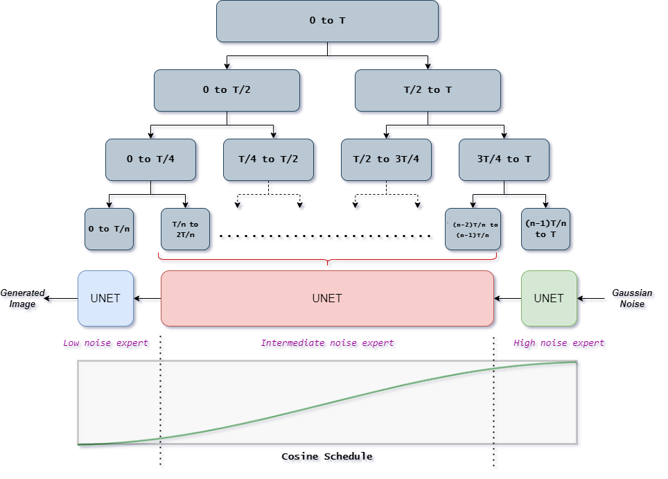

# EnFusion: Image Generation with an Ensemble of Expert Denoisers
In this project, we build an Ensemble of Expert Denoisers for Image generation using DDPMs (Denoising Diffusion Probabilistic Models). Expert Denoisers comprise of three models, each specializing in denoising images at low-level noise, intermediate-level noise and high-level noise respectively. We compare this approach with the vanilla diffusion process and establish that the initial stage of denoising (with high noise levels) and the final stage of denoising (with low noise levels) are crucial and having dedicated denoisers trained for these stages help the model with better generation.
<!-- 
*Abstract view of Ensemble of Expert Denoisers* -->
<figure>

<figcaption align = "center"><b>Fig.1 - Abstract view of Ensemble of Expert Denoisers </b></figcaption>
</figure>
 
<figure>

<figcaption align = "center"><b>Fig.2 - Images generated with vanilla diffusion process </b></figcaption>
</figure>
 
<figure>

<figcaption align = "center"><b>Fig.3 - Images generated with Enfusion: Ensemble of Experts </b></figcaption>
</figure>
